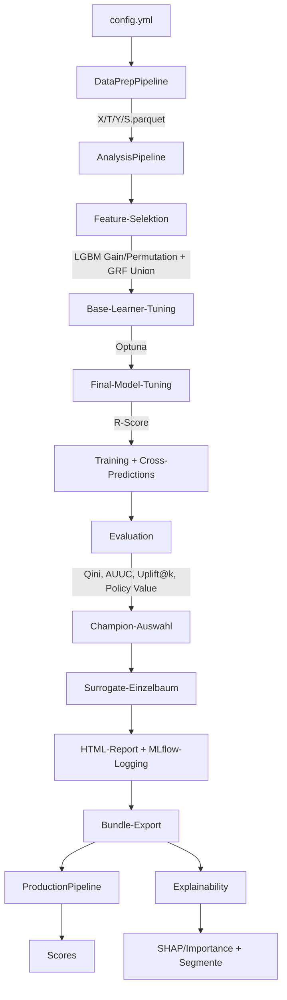

# Architektur

rubin ist ein modulares Python-Framework für kausale Modellierung (Causal ML). Die Architektur folgt vier Leitideen:

1. **Analyse ≠ Produktion** — Analyse darf experimentieren (Feature-Selektion, Tuning, Modellvergleich). Produktion bleibt stabil, reproduzierbar und frei von Trainingslogik.
2. **Artefakt-basierte Übergabe** — Alles, was Produktion braucht, wird beim Analyselauf synchron in ein Bundle exportiert.
3. **Strikte Konfiguration** — Eine YAML-Datei steuert das gesamte Verhalten, validiert mit Pydantic (`extra="forbid"`).
4. **Erweiterbarkeit über Registries** — Neue Modelle und Base-Learner werden zentral über Factory/Registry angebunden.


## Gesamtfluss




## DataPrepPipeline

Einmalige, reproduzierbare Aufbereitung von Rohdaten in standardisierte Parquet-Dateien.

**Eingabe:** Rohdaten (CSV, Parquet, SAS), optional Feature-Dictionary (Excel)

**Ablauf:**
- Einlesen (chunked, multi-file mit merge/treatment_only-Logik)
- Deduplizierung (optional: ein Eintrag pro Kunden-ID)
- Feature-Selektion: über Feature-Dictionary (Spalte ROLE = INPUT) falls vorhanden, sonst alle Spalten außer Target/Treatment
- Replacement-Maps, Fill-NA, Encoding, Speicherreduktion (Downcasting)
- Optional: Eval-Daten transformieren (`eval_data_path`) — Preprocessor wird nur auf Train gefittet, Eval-Daten werden nur transformiert (kein Leakage)

**Ausgabe:** `X.parquet`, `T.parquet`, `Y.parquet`, optional `S.parquet`, `preprocessor.pkl`, `dtypes.json`, `schema.json`. Bei `eval_data_path`: zusätzlich `X_eval.parquet`, `T_eval.parquet`, `Y_eval.parquet`.

```bash
pixi run dataprep -- --config <CONFIG>
# oder: python run_dataprep.py --config <CONFIG>
```


## AnalysisPipeline

Training, Evaluation und optionaler Bundle-Export — der zentrale Workflow.

### Schritt 1: Daten laden
X, T, Y (optional S) aus Parquet. Optionales Downsampling (`df_frac`), Dtype-Alignment. Drei Validierungsmodi:
- `validate_on: cross` — Cross-Predictions (K-Fold) auf dem gleichen Datensatz (Standard)
- `validate_on: holdout` — Stratifizierter Train/Test-Split des gleichen Datensatzes
- `validate_on: external` — Training auf `data_files`, Evaluation auf separatem Datensatz (`eval_x/t/y_file`). Kein Data-Leakage, da der Preprocessor in der DataPrep nur auf Train gefittet wird.

Bei `holdout` und `external` wird nach der Feature-Selektion ein Feature-Alignment auf die Eval-Daten angewendet (`reindex`), damit entfernte Features korrekt behandelt werden.

### Schritt 2: Feature-Selektion (optional)
Mehrere Importance-Methoden kombinierbar per Union:
- **lgbm_importance**: LightGBM auf Outcome (Y), Gain-Importance
- **lgbm_permutation**: LightGBM auf Outcome (Y), Permutation-Importance
- **causal_forest**: GRF CausalForest Feature-Importances (kausale Heterogenität)

Pro Methode werden die Top-X% behalten, dann per Union vereinigt. Anschließend Korrelationsfilter (Pearson + Spearman). Die LightGBM-Fits nutzen automatisch native kategoriale Splits (via `categorical_feature`-Patch). Die Methoden laufen sequentiell, aber jede nutzt alle CPU-Kerne. CausalForest subsampelt große Datensätze (>100k) automatisch stratifiziert nach Treatment. Bei Multi-Treatment wird T für GRF automatisch binarisiert (Control vs. Any Treatment).

### Schritt 3: Base-Learner-Tuning (optional)
Optuna optimiert die Nuisance-Modelle (Outcome, Propensity). Task-basiertes Sharing: identische Lernaufgaben werden dedupliziert. Jede Optuna-Study erhält einen eigenen, deterministisch aus dem Basis-Seed abgeleiteten Seed (`sha256`), damit verschiedene Tasks unterschiedliche Hyperparameter-Bereiche explorieren. Bei Level 3–4 laufen mehrere Optuna-Trials parallel (`study.optimize(n_jobs=...)`), wobei die CPU-Kerne proportional aufgeteilt werden. Best-Scores werden als `bl_score__<Modell>__<Rolle>` nach MLflow geloggt.

Kategorische Features: Vor dem Tuning werden die `.fit()`-Methoden von LightGBM/CatBoost via `partialmethod` gepatcht, sodass `categorical_feature` bzw. `cat_features` bei jedem internen Aufruf automatisch übergeben wird — auch wenn EconML X intern zu numpy konvertiert.

### Schritt 4: Final-Model-Tuning (optional)
R-Score/R-Loss für das CATE-Effektmodell (`model_final`, nur NonParamDML, DRLearner). Locking: nur auf dem ersten CV-Fold, Parameter für alle Folds wiederverwendet. Ohne FMT verwendet `model_final` ausschließlich LightGBM/CatBoost-Standardwerte — die getunten Nuisance-Parameter werden bewusst nicht vererbt, da deren Regularisierung den CATE-Baum zum Kollaps bringen kann.

### Schritt 5: Training + Cross-Predictions
Alle konfigurierten kausalen Learner werden trainiert. Alle DML-Modelle und DRLearner nutzen intern `cv=5` für die Nuisance-Residualisierung. Cross-Predictions (K-Fold Out-of-Fold) erzeugen für jede Beobachtung eine Vorhersage aus einem Modell, das diese Beobachtung nicht gesehen hat. Die CV-Folds können je nach `constants.parallel_level` parallel verarbeitet werden (joblib, Thread-Backend). Ausnahme: CausalForestDML läuft immer sequentiell, da der interne GRF joblib-Prozesse für die Baum-Parallelisierung spawnt — in Threads führt das zu Deadlocks. Die CPU-Kerne werden proportional auf die parallelen Folds aufgeteilt, um Übersubskription zu vermeiden.

### Schritt 6: Evaluation
Die Evaluation läuft in drei Phasen:

1. **Schnelle Metriken + CATE-Verteilung (alle Modelle):** Qini, AUUC, Uplift@10/20/50%, Policy Value — reines NumPy, <1s pro Modell. Grundlage für Champion-Selektion. CATE-Verteilungs-Histogramme (Training + Cross-Validated) zeigen die Effektverteilung pro Modell.
2. **DRTester-Diagnostik (Level-abhängig):** Calibration, Qini/TOC mit Bootstrap-CIs. Nuisance-Modelle nutzen leichtere Varianten (n_estimators≤100, cv=3) für schnelleres Fitting. Level 1–2: alle Modelle, Level 3: Champion + Challenger, Level 4: nur Champion.
3. **scikit-uplift-Plots (alle Modelle):** Qini-Kurve, Uplift-by-Percentile, Treatment-Balance — immer für alle Modelle, da schnell (~2-5s).

Optional: Vergleich gegen historischen Score. Bei MT werden die DRTester-Nuisance-Fits pro Arm bei Level 3–4 parallel ausgeführt.

### Schritt 7: Surrogate-Einzelbaum (optional)
Bei `surrogate_tree.enabled: true` wird ein interpretierbarer Einzelbaum trainiert, der die CATE-Vorhersagen des Champions nachlernt (Teacher-Learner). Nutzt LightGBM oder CatBoost mit `n_estimators=1`. Bei Multi-Treatment wird pro Arm ein separater Baum erzeugt.

### Schritt 8: Champion-Auswahl + Bundle-Export
Bestes Modell anhand der konfigurierten Metrik (Standard: Qini). Optional manuell festlegbar. Bundle-Export schreibt alle Production-Artefakte synchron.

### Schritt 9: HTML-Report
Am Ende wird automatisch ein `analysis_report.html` erzeugt — ein selbstständiger Report mit Datengrundlage, Config-Zusammenfassung, Tuning-Güte, Modellvergleich (Champion hervorgehoben), Diagnose-Plots pro Modell mit Erklärungstexten, Surrogate-Vergleich und optionaler Explainability-Sektion. Der Report wird als MLflow-Artefakt geloggt.

```bash
pixi run analyze -- --config <CONFIG> --export-bundle --bundle-dir bundles
# oder: python run_analysis.py --config <CONFIG> [--export-bundle --bundle-dir bundles]
```


## Bundles

Ein Bundle ist ein Verzeichnis mit allen Artefakten für reproduzierbares Scoring:

| Datei | Beschreibung |
|---|---|
| `config_snapshot.yml` | Verwendete Konfiguration |
| `preprocessor.pkl` | Transformationslogik (Feature-Reihenfolge, Dtypes, Encoding) |
| `models/*.pkl` | Trainierte Modelle (Champion + Challenger) |
| `model_registry.json` | Champion/Challenger-Manifest mit Metriken |
| `schema.json` | Feature-Schema (erwartete Spalten, Typen) |
| `dtypes.json` | Referenz-Datentypen |
| `metadata.json` | Erstellungszeit, Refit-Info, Feature-Spalten |
| `SurrogateTree.pkl` | Optional: interpretierbarer Einzelbaum |


## ProductionPipeline

Stabiles, reproduzierbares Scoring auf neuen Daten — ohne Training, Tuning oder Feature-Selektion.

**Ablauf:** Preprocessor laden → Dtype-Alignment → Schema-Check → Transform → Scoring → Output

**Scoring-Optionen:**
- Champion (Standard) aus `model_registry.json`
- Spezifisches Modell: `--model-name NonParamDML`
- Alle Modelle: `--use-all-models`
- Surrogate-Einzelbaum: `--use-surrogate`

```bash
pixi run score -- --bundle <BUNDLE> --x <DATEI> --out scores.csv
# oder: python run_production.py --bundle <BUNDLE> --x <DATEI> --out scores.csv
```


## Explainability

Separater Runner, damit Analyse und Production schlank bleiben.

**Methoden:**
- **SHAP** (Standard): Modellagnostische SHAP-Werte für f(X) = CATE(X)
- **Permutation Importance**: Robuster Fallback ohne shap-Abhängigkeit

**Segmentanalyse:**
- Score-Dezile: mittlerer CATE, Outcome-Rate, Anzahl pro Segment
- Feature-Segmente: Top-Features in Bins (numerisch) oder Kategorien

```bash
pixi run explain -- --bundle <BUNDLE> --x <DATEI> --out-dir explain
# oder: python run_explain.py --bundle <BUNDLE> --x <DATEI> --out-dir explain
```


## Unterstützte Modelle

| Modell | Familie | BT | MT | Final-Tuning | NaN-tolerant |
|---|---|---|---|---|---|
| SLearner | Meta-Learner | ✓ | ✗ | – | ✓ |
| TLearner | Meta-Learner | ✓ | ✗ | – | ✓ |
| XLearner | Meta-Learner | ✓ | ✗ | – | ✓ |
| DRLearner | Doubly Robust | ✓ | ✓ | R-Score | ✓ |
| NonParamDML | DML | ✓ | ✓ | R-Score | ✓ |
| ParamDML | DML (LinearDML) | ✓ | ✓ | – | ✓ |
| CausalForestDML | DML + Forest | ✓ | ✓ | EconML tune() | **✗** |

Alle DML-Modelle und DRLearner: `discrete_treatment=True`, `discrete_outcome=True`.

**Fehlende Werte:** Alle Modelle außer CausalForestDML können mit fehlenden Werten umgehen,
da sie LightGBM oder CatBoost als Base Learner nutzen. CausalForestDML basiert intern auf
einem GRF (Generalized Random Forest), der keine fehlenden Werte unterstützt. Bei fehlenden
Werten in den Daten wird CausalForestDML automatisch übersprungen. Gleiches gilt für die
Feature-Selektionsmethode `causal_forest` (GRF).


## Multi-Treatment

rubin unterstützt neben Binary Treatment (T ∈ {0,1}) auch Multi-Treatment (T ∈ {0,1,…,K-1}):

| Aspekt | Binary Treatment | Multi-Treatment |
|---|---|---|
| CATE-Output | 1 Wert (n,) | K-1 Werte (n, K-1) |
| Modelle | Alle 7 | DML-Familie + DRLearner (4) |
| Evaluation | Qini, AUUC, Uplift@k, PV | Pro-Arm-Metriken + per-Arm PV + globaler Policy Value (IPW) |
| Champion-Metrik | `qini` (empfohlen) | `policy_value` (empfohlen), alternativ `policy_value_treat_positive_T1`, `qini_T1` etc. |
| Propensity-Tuning | Binäre AUC | `roc_auc_ovr` (Multiclass) |
| Production-Output | `cate_<M>` | `cate_<M>_T1…`, `optimal_treatment`, `confidence` |
| Surrogate | 1 Baum | 1 Baum pro Arm |
| Explainability | SHAP auf CATE(X) | SHAP auf max(τ_k(X)) |
| Hist. Score-Vergleich | ✓ | ✗ |

BT ist ein Spezialfall von MT (K=2). Im Code wird das (n,1)-Array zum (n,)-Array gequetscht — derselbe Codepfad. Nur bei Plots, Reports und Policy-Zuweisung gibt es eine MT-Verzweigung.
