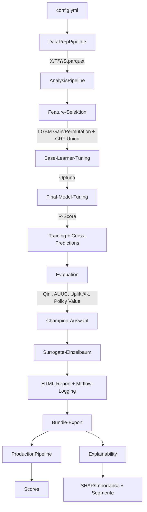

# Architektur

rubin ist ein modulares Python-Framework für kausale Modellierung (Causal ML). Die Architektur folgt vier Leitideen:

1. **Analyse ≠ Produktion** — Analyse darf experimentieren (Feature-Selektion, Tuning, Modellvergleich). Produktion bleibt stabil, reproduzierbar und frei von Trainingslogik.
2. **Artefakt-basierte Übergabe** — Alles, was Produktion braucht, wird beim Analyselauf synchron in ein Bundle exportiert.
3. **Strikte Konfiguration** — Eine YAML-Datei steuert das gesamte Verhalten, validiert mit Pydantic (`extra="forbid"`).
4. **Erweiterbarkeit über Registries** — Neue Modelle und Base-Learner werden zentral über Factory/Registry angebunden.


## Gesamtfluss




## DataPrepPipeline

Einmalige, reproduzierbare Aufbereitung von Rohdaten in standardisierte Parquet-Dateien.

**Eingabe:** Rohdaten (CSV, Parquet, SAS), optional Feature-Dictionary (Excel)

**Ablauf:**
- Einlesen (chunked, multi-file mit merge/treatment_only-Logik)
- Treatment-Balance-Prüfung bei mehreren Dateien (Warnung bei >5pp Unterschied, optionales Downsampling per `balance_treatments`)
- Optional: „Train Many, Evaluate One" — Eval-Maske (`eval_mask.npy`) aus `eval_file_index` extrahieren
- Deduplizierung (optional: ein Eintrag pro Kunden-ID)
- Feature-Selektion: über Feature-Dictionary (Spalte ROLE = INPUT) falls vorhanden, sonst alle Spalten außer Target/Treatment
- Replacement-Maps, Fill-NA, Encoding, Speicherreduktion (Downcasting)
- Optional: Eval-Daten transformieren (`eval_data_path`) — Preprocessor wird nur auf Train gefittet, Eval-Daten werden nur transformiert (kein Leakage)

**Ausgabe:** `X.parquet`, `T.parquet`, `Y.parquet`, optional `S.parquet`, `eval_mask.npy`, `preprocessor.pkl`, `dtypes.json`, `schema.json`. Bei `eval_data_path`: zusätzlich `X_eval.parquet`, `T_eval.parquet`, `Y_eval.parquet`.

**MLflow-Logging (optional):** Bei `log_to_mlflow: true` wird ein eigener MLflow-Run erzeugt (Name: `Datenaufbereitung – <adjektiv>-<nomen>`). Experiment-Name und Run-Name werden als `.mlflow_experiment` und `.mlflow_run_name` im Output-Verzeichnis persistiert, damit die Analyse-Pipeline und die Web-UI sie automatisch übernehmen können. Die Web-UI liest diese über `GET /api/dataprep-info` und setzt den Experiment-Namen auf der Konfigurationsseite vor.

```bash
pixi run dataprep -- --config <CONFIG>
# oder: python run_dataprep.py --config <CONFIG>
```


## AnalysisPipeline

Training, Evaluation und optionaler Bundle-Export — der zentrale Workflow.

### Schritt 1: Daten laden
X, T, Y (optional S, optional eval_mask) aus Parquet/NPY. Optionales Downsampling (`df_frac`), Dtype-Alignment. Kategorische Spalten werden aus der Konfiguration oder den Datentypen wiederhergestellt. Historische Scores werden beim Laden auf NaN/Inf geprüft und durch 0 ersetzt; fehlt die S-Spalte in der Datei, wird eine Warnung geloggt statt eines Crashs. Zwei Validierungsmodi:
- `validate_on: cross` — Cross-Predictions (K-Fold) auf dem gleichen Datensatz (Standard). Kombinierbar mit einer Eval-Maske für „Train Many, Evaluate One".
- `validate_on: external` — Training auf `data_files`, Evaluation auf separatem Datensatz (`eval_x/t/y_file`). Kein Data-Leakage, da der Preprocessor in der DataPrep nur auf Train gefittet wird.

**Alignment-Garantie:** Nach dem Laden wird X's Index auf 0-basiert zurückgesetzt (`reset_index`). Bei `df_frac`-Subsampling werden T, Y, S per label-basiertem `.loc[idx]` selektiert (gleiche Zeilen wie X). Die eval_mask nutzt `get_indexer` für positionssichere Indexierung. Assertions prüfen `len(X) == len(T) == len(Y)` (und S/eval_mask wenn vorhanden).

Bei `external` wird nach der Feature-Selektion ein Feature-Alignment auf die Eval-Daten angewendet (`reindex`), damit entfernte Features korrekt behandelt werden.

Die DataPrep-Konfiguration (`dataprep_config.yml`) wird automatisch nach MLflow mitgeloggt, sofern sie im Verzeichnis der Eingabedaten liegt.

### Schritt 2: Feature-Selektion (optional)
Vierstufiger Prozess:
1. **Importances berechnen** (auf ALLEN Features) — mehrere Methoden kombinierbar:
   - **lgbm_importance**: LightGBM auf Outcome (Y), Gain-Importance
   - **lgbm_permutation**: LightGBM auf Outcome (Y), Permutation-Importance
   - **causal_forest**: GRF CausalForest Feature-Importances (kausale Heterogenität)
2. **Korrelationsfilter** (importance-gesteuert) — bei korrelierten Paaren (|r| > Schwellwert) wird das Feature mit der niedrigeren aggregierten Importance entfernt. Pearson zuerst, dann Spearman nur auf überlebenden Spalten.
3. **Importance-Umverteilung** — die Importance des entfernten Features wird auf den überlebenden Partner addiert, um das Importance-Splitting bei korrelierten Features zu korrigieren.
4. **Top-X%-Threshold** — pro Methode die Top-X% der (korrigierten) Importances, dann Union.

Die LightGBM-Fits nutzen automatisch native kategoriale Splits (via `categorical_feature`-Patch). Die Methoden laufen sequentiell, aber jede nutzt alle CPU-Kerne. CausalForest subsampelt große Datensätze (>100k) automatisch stratifiziert nach Treatment. Bei Multi-Treatment wird T für GRF automatisch binarisiert (Control vs. Any Treatment). Globale Seeds (`np.random.seed`, `random.seed`) werden vor dem GRF-Fit gesetzt für maximale Reproduzierbarkeit.

### Schritt 3: Base-Learner-Tuning (optional)
Optuna optimiert die Nuisance-Modelle (Outcome, Propensity). Task-basiertes Sharing: identische Lernaufgaben werden dedupliziert. Jede Optuna-Study erhält einen eigenen, deterministisch aus dem Basis-Seed abgeleiteten Seed (`sha256`), damit verschiedene Tasks unterschiedliche Hyperparameter-Bereiche explorieren. Der TPE-Sampler ist mit `multivariate=True` und `constant_liar=True` konfiguriert, die Startup-Trials skalieren adaptiv mit der Gesamtzahl. Ein `MedianPruner` bricht unpromising Trials nach 1-2 CV-Folds ab (typisch ~30-50% Zeitersparnis). Bei Level 3-4 laufen mehrere Optuna-Trials parallel (`study.optimize(n_jobs=...)`). `catch=(Exception,)` verhindert, dass einzelne fehlgeschlagene Trials die Study stoppen.

Kategorische Features und der `partialmethod`-Patch: EconML konvertiert die Feature-Matrix `X` intern über sklearn's `check_array` zu einem numpy-Array. Dabei gehen pandas category-Dtypes verloren — LightGBM und CatBoost erhalten dann nur float64-Werte und nutzen ordinale statt kategoriale Splits (deutlich schwächere Modellierung bei nominalen Features). Der `patch_categorical_features()`-Context-Manager (`rubin/utils/categorical_patch.py`) löst das, indem er die `.fit()`-Methoden von `LGBMClassifier`, `LGBMRegressor`, `CatBoostClassifier` und `CatBoostRegressor` auf Klassen-Ebene mit `functools.partialmethod` patcht. Damit wird `categorical_feature=<indices>` (LightGBM) bzw. `cat_features=<indices>` (CatBoost) bei jedem `.fit()`-Aufruf automatisch übergeben — auch wenn EconML intern nur `model.fit(X_numpy, y)` aufruft. Die Spaltenindizes werden über `_detect_cat_indices()` aus den aktuellen category-/object-Spalten von X ermittelt. In der Pipeline gibt es zwei Patch-Kontexte: (1) Feature-Selektion — mit den Spaltenindizes vor FS, damit kategorische Features in der LightGBM-Importance nicht unterbewertet werden. (2) Tuning + Training + Evaluation + Surrogate + Refit — mit den Spaltenindizes nach FS. Der Patch wirkt auf Klassen-Ebene, d.h. alle Instanzen innerhalb des `with`-Blocks sind betroffen (inkl. Optuna-Trials, Cross-Prediction-Folds, DRTester-Nuisance, Surrogate-Bäume). Im `finally`-Block werden die Originale immer wiederhergestellt — kein globaler State-Leak.

### Schritt 4: Final-Model-Tuning (optional)
R-Score/R-Loss für das CATE-Effektmodell (`model_final`, nur NonParamDML, DRLearner). Locking: nur auf dem ersten CV-Fold, Parameter für alle Folds wiederverwendet. Ohne FMT verwendet `model_final` ausschließlich LightGBM/CatBoost-Standardwerte — die getunten Nuisance-Parameter werden bewusst nicht vererbt, da deren Regularisierung den CATE-Baum zum Kollaps bringen kann.

### Schritt 5: Training + Cross-Predictions
Alle konfigurierten kausalen Learner werden trainiert. Alle DML-Modelle und DRLearner nutzen intern `cv=5` für die Nuisance-Residualisierung. Cross-Predictions (K-Fold Out-of-Fold) erzeugen für jede Beobachtung eine Vorhersage aus einem Modell, das diese Beobachtung nicht gesehen hat. Die CV-Folds können je nach `constants.parallel_level` parallel verarbeitet werden (joblib, Thread-Backend). Ausnahme: CausalForestDML läuft immer sequentiell, da der interne GRF joblib-Prozesse für die Baum-Parallelisierung spawnt — in Threads führt das zu Deadlocks. Die CPU-Kerne werden proportional auf die parallelen Folds aufgeteilt, um Übersubskription zu vermeiden.

### Schritt 6: Evaluation
Die Evaluation läuft in drei Phasen:

1. **Schnelle Metriken + CATE-Verteilung (alle Modelle):** Qini, AUUC, Uplift@10/20/50%, Policy Value — reines NumPy, <1s pro Modell. Grundlage für Champion-Selektion (nur trainierte Modelle, historischer Score ausgeschlossen). CATE-Verteilungs-Histogramme (Training + Cross-Validated) zeigen die Effektverteilung pro Modell.
2. **DRTester-Diagnostik (Level-abhängig):** Calibration, Qini/TOC mit Bootstrap-CIs. Nuisance-Modelle nutzen leichtere Varianten (n_estimators≤100, cv=3) für schnelleres Fitting. Level 1–2: alle Modelle, Level 3: Champion + Challenger, Level 4: nur Champion. Jeder Sub-Test (BLP, Cal, Qini, TOC) läuft in einem eigenen try/except — wenn BLP crasht, werden Qini/TOC und Policy Values trotzdem berechnet.
3. **scikit-uplift-Plots (alle Modelle):** Qini-Kurve, Uplift-by-Percentile, Treatment-Balance — immer für alle Modelle, da schnell (~2-5s). Alle sklift-Aufrufe verwenden das sichere `ax=`-Pattern (eigene Figure+Axes vorab erstellt), um instabile Rückgabetypen zu umgehen. Bei sklift-Fehlern werden native Fallback-Implementierungen verwendet; Fehler und Erfolge werden geloggt. `recolor_figure()` überträgt das rubin-Farbschema auf alle Plots.

Optional: Vergleich gegen historischen Score (Policy-Value-Comparison als letzter Schritt, nachdem alle Modell- und Historical-Policy-Values berechnet sind). Bei MT werden die DRTester-Nuisance-Fits pro Arm bei Level 3–4 parallel ausgeführt. Bei aktiver Eval-Maske (`eval_mask_file`) werden die Metriken und DRTester-Plots nur auf den markierten Zeilen berechnet, während alle Daten für Training und Cross-Prediction genutzt werden (Train Many, Evaluate One). Der pre-fitted DRTester (`fitted_tester_bt`) wird aus `_run_evaluation` an `run()` zurückgegeben und für den Surrogate-Block wiederverwendet.

### Schritt 7: Surrogate-Einzelbaum
rubin trainiert einen Surrogate-Einzelbaum auf den **Cross-Predicted CATEs des Champions**, wenn `surrogate_tree.enabled: true`. Das gilt für alle Champion-Modelle, einschließlich CausalForestDML.

Der Surrogate nutzt LightGBM oder CatBoost mit `n_estimators=1`. Bei Multi-Treatment wird pro Arm ein separater Baum erzeugt.

**Target:** Die **Cross-Predicted CATEs** (`Predictions_`-Spalte) werden als Regressionsziel verwendet — jedes Sample hat einen CATE aus einem Modell, das es nie gesehen hat. Zusätzlich wird eine eigene KFold-CV auf dem Surrogate durchgeführt, damit auch die Surrogate-Metriken ehrlich sind. Für den finalen Export wird der Surrogate auf allen Daten neu trainiert.

### Schritt 8: Champion-Auswahl + Bundle-Export
Bestes Modell anhand der konfigurierten Metrik (Standard: Qini). Optional manuell festlegbar. Bundle-Export schreibt alle Production-Artefakte synchron.

### Schritt 9: Explainability
Bei `shap_values.calculate_shap_values: true`: SHAP-Werte (oder Permutation-Importance als Fallback), Importance-Plots für den Champion. SHAP-Werte werden auf Out-of-Sample-Daten berechnet (CV: letztes Fold-Modell + Out-of-Fold-Samples, External: Eval-Daten). Artefakte werden als MLflow-Artefakte geloggt und in den HTML-Report eingebettet.

### Schritt 10: HTML-Report
Am Ende wird automatisch ein `analysis_report.html` erzeugt — ein selbstständiger Report mit Datengrundlage, Config-Zusammenfassung, Tuning-Güte, Modellvergleich (Champion hervorgehoben), Diagnose-Plots pro Modell mit Erklärungstexten, Surrogate-Vergleich und optionaler Explainability-Sektion. Alle Plots sind klickbar und öffnen eine Lightbox-Vergrößerung. Der Report wird in `.rubin_cache/` (für die App) und als MLflow-Artefakt gespeichert, optional zusätzlich in `output_dir`. Der Report wird nie ins Projektverzeichnis geschrieben.

```bash
pixi run analyze -- --config <CONFIG> --export-bundle --bundle-dir bundles
# oder: python run_analysis.py --config <CONFIG> [--export-bundle --bundle-dir bundles]
```


## Bundles

Ein Bundle ist ein Verzeichnis mit allen Artefakten für reproduzierbares Scoring:

| Datei | Beschreibung |
|---|---|
| `config_snapshot.yml` | Verwendete Konfiguration |
| `preprocessor.pkl` | Transformationslogik (Feature-Reihenfolge, Dtypes, Encoding) |
| `models/*.pkl` | Trainierte Modelle (Champion + Challenger) |
| `model_registry.json` | Champion/Challenger-Manifest mit Metriken |
| `schema.json` | Feature-Schema (erwartete Spalten, Typen) |
| `dtypes.json` | Referenz-Datentypen |
| `metadata.json` | Erstellungszeit, Refit-Info, Feature-Spalten |
| `SurrogateTree.pkl` | Optional: interpretierbarer Einzelbaum |


## ProductionPipeline

Stabiles, reproduzierbares Scoring auf neuen Daten — ohne Training, Tuning oder Feature-Selektion.

**Ablauf:** Preprocessor laden → Dtype-Alignment → Schema-Check → Transform → Scoring → Output

**Scoring-Optionen:**
- Champion (Standard) aus `model_registry.json`
- Spezifisches Modell: `--model-name NonParamDML`
- Alle Modelle: `--use-all-models`
- Surrogate-Einzelbaum: `--use-surrogate`

```bash
pixi run score -- --bundle <BUNDLE> --x <DATEI> --out scores.csv
# oder: python run_production.py --bundle <BUNDLE> --x <DATEI> --out scores.csv
```


## Explainability

Separater Runner, damit Analyse und Production schlank bleiben.

**Methoden:**
- **SHAP** (Standard): Modellagnostische SHAP-Werte für f(X) = CATE(X)
- **Permutation Importance**: Robuster Fallback ohne shap-Abhängigkeit


**Fehlende Werte:** Alle Modelle außer CausalForestDML können mit fehlenden Werten umgehen,
da sie LightGBM oder CatBoost als Base Learner nutzen. CausalForestDML basiert intern auf
einem GRF (Generalized Random Forest), der keine fehlenden Werte unterstützt. Bei fehlenden
Werten in den Daten wird CausalForestDML automatisch übersprungen. Gleiches gilt für die
Feature-Selektionsmethode `causal_forest` (GRF).


## Multi-Treatment

rubin unterstützt neben Binary Treatment (T ∈ {0,1}) auch Multi-Treatment (T ∈ {0,1,…,K-1}):

| Aspekt | Binary Treatment | Multi-Treatment |
|---|---|---|
| CATE-Output | 1 Wert (n,) | K-1 Werte (n, K-1) |
| Modelle | Alle 7 | DML-Familie + DRLearner (4) |
| Evaluation | Qini, AUUC, Uplift@k, PV | Pro-Arm-Metriken + per-Arm PV + globaler Policy Value (IPW) |
| Champion-Metrik | `qini` (empfohlen) | `policy_value` (empfohlen), alternativ `policy_value_treat_positive_T1`, `qini_T1` etc. |
| Propensity-Tuning | Binäre AUC | `roc_auc_ovr` (Multiclass) |
| Production-Output | `cate_<M>` | `cate_<M>_T1…`, `optimal_treatment`, `confidence` |
| Surrogate | 1 Baum | 1 Baum pro Arm |
| Explainability | SHAP auf CATE(X) | SHAP auf max(τ_k(X)) |
| Hist. Score-Vergleich | ✓ | ✗ |

BT ist ein Spezialfall von MT (K=2). Im Code wird das (n,1)-Array zum (n,)-Array gequetscht — derselbe Codepfad. Nur bei Plots, Reports und Policy-Zuweisung gibt es eine MT-Verzweigung.
